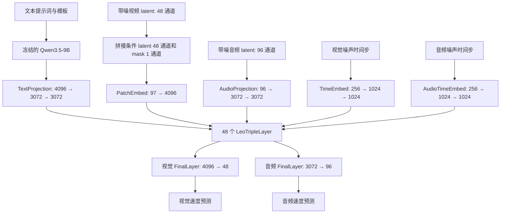
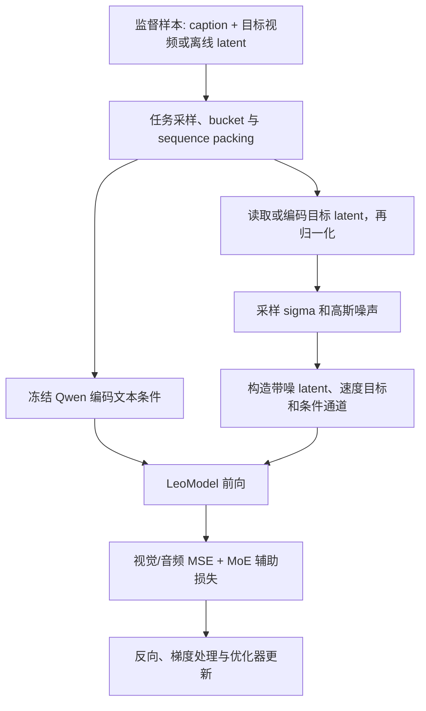

# Leo2 模型架构、参数分布、监督训练与推理分析

> 分析日期：2026-09-06。代码基线：`16e5dd4` 及当前工作区。
> 本文依据源码、外部资产配置和实际 DCP checkpoint 的 tensor shape 元数据分析。骨干参数总量已与 checkpoint 元数据核对一致；GPU 缓存与 RL 验证进展另见[测试报告](results/preprocessing_topology_20260906/BENCHMARK_REPORT.md)，原生 GPU SFT 尚待验证。

## 1. 核心结论与分析范围

本仓库默认 Leo2 是一个**在连续 VAE latent 空间上做 Flow Matching 的多模态 Diffusion Transformer**。生成骨干有 48 层，每层包含视觉、文本、音频三个分支：分支分别投影、归一化和做 FFN，在 Attention 中交换信息。

- **视觉分支**：隐藏维度 4096，第 0 层是 Dense FFN，第 1–47 层是 MoE；每层 64 个路由专家，每个 token 选择 8 个，另有 1 个共享专家。
- **文本分支**：隐藏维度 3072，Dense FFN；输入来自冻结的 Qwen3.5-9B。它是生成骨干内部的文本分支，和外部 Qwen 编码器是两个不同模块。
- **音频分支**：隐藏维度 3072，Dense FFN；支持与视觉联合去噪，但 UniRL 当前 Leo2 管线接入的是 T2V。
- **默认三分支骨干约 75.224B 参数**，其中视觉路由专家约 56.774B，占 75.47%。不含外部文本编码器、VAE、LoRA 或优化器状态。
- **监督训练目标是速度场回归**：学习从带噪 latent 预测 `noise - clean_latent`，使用 MSE；文本提供条件，不计算语言模型 next-token CE。
- **推理是整段视频 latent 的迭代去噪**，随后 VAE 解码。`gen_ar` 目录名、HF `GenerationMixin` 和文本 token 模板不意味着视频按 token 或按帧自回归生成。
- **UniRL 已补充离线缓存 SFT 接入**：预处理完整文本条件与目标视频 latent，训练阶段可不加载 Qwen/VAE；使用 Leo2 专用 builder 与现有 FlowMatchSFT。接口经 CPU 替身模型验证，原生 GPU 端到端验证仍待完成，见[预处理与 offload 说明](../../../../unirl/models/leo2/README.md)。

默认组合由 [stage-3 YAML][stage3] 指定：

| 角色 | 模型注册名 |
| --- | --- |
| 主分支 | `diffusion.leo-2-moe-v1-1-pack-noTR` |
| 文本分支 | `diffusion.leo-2-moe-v1-1-pack-txt-branch` |
| 音频分支 | `diffusion.leo-2-moe-v1-1-pack-audio-branch` |
| 原生训练模型类 | `LeoModel` |
| UniRL 实际构造类 | `LeoModelHF`，由 bundle 将结构名追加 `HF` |
| 固定权重档案 | `leo2-a12b-480p-iter0063300-native-dcp` |

`leo_config.py` 还注册了 Dense、MoE v1-2、MoE v2-1 等变体；下文的层数和参数表专指上述默认组合，不能外推到全部 Leo2 变体。[模型注册配置][config]、[构模入口][build-model]、[UniRL bundle][bundle]

## 2. 总体架构与张量流



### 2.1 视觉 latent、token 数与条件通道

视频 VAE 的空间压缩率为 16，时间压缩率为 4，latent 通道数为 48。对于合法帧数 `F = 4k + 1`：

```text
像素视频：       [B, 3, F, H, W]
归一化 latent： [B, 48, (F-1)/4+1, H/16, W/16]
模型输入：      [B, 97, (F-1)/4+1, H/16, W/16]
视觉 token：    [B, Nv, 4096]
Nv = ((F-1)/4+1) × (H/16) × (W/16)
```

`patch_size=1` 指 **latent 空间的 patch**。实际 `PatchEmbed` 使用 kernel/stride 为 `(1,1,1)` 的 `Conv3d`，作用等价于在每个 latent 网格点上做 `97 → 4096` 的线性投影，没有再缩短 token 序列。

97 个输入通道的顺序是：

```text
[正在去噪的 latent：48 | 条件 latent：48 | 条件 mask：1]
```

| 任务 | 条件 latent | mask |
| --- | --- | --- |
| T2V / T2I | 全零 | 全零 |
| I2V | 第一帧位置放置参考 latent | 第一帧为 1 |
| FL2V | 首、末位置放置参考 latent | 首、末位置为 1 |

模型输出只包含 48 通道的目标速度，不需要预测条件通道。原生代码还支持独立参考序列等路径；上表对应当前默认 `ref_mode=channel` 使用的条件机制。[输入输出投影][patch]、[原生条件构造][native-pipeline]、[加噪与通道扩展][autoencoders]

本次实际生产 bucket 为 `121 帧 × 464 × 848`，得到 latent `[1,48,31,29,53]`，即 `31 × 29 × 53 = 47647` 个视觉 token。拓扑筛选和最终完整批量验证均使用这一几何。

### 2.2 文本分支与 noTR

外部文本编码器为冻结的 Qwen3.5-9B，配置 `hidden_state_skip_layer=2`，代码取 `hidden_states[-3]` 作为条件表示。YAML 的编码长度参数为 1024；数据侧 prompt 长度、模板和 packed 编码另有处理，不能把所有任务的最终序列长度统一视为 1024。

`noTR` 选择 `text_proj_type="linear"`，实际实现是：

```text
Linear(4096, 3072, bias=True)
→ SiLU
→ Linear(3072, 3072, bias=True)
```

这里的 `linear` 是投影类型名称，**实现有两层 Linear**。它替换的是两层 `SingleTokenRefiner`，并不删除文本条件或生成骨干内部的文本分支。[文本编码器][text-encoder]、[TextProjection][embed]、[模型初始化][leo]

### 2.3 音频与 VAE 的边界

音频分支注册配置中的 latent 维度是 64，但 stage-3 YAML 用冻结参数 `audio_branch_audio_vae_latent_dim=96` 覆盖。因此本版本的音频投影为 `96 → 3072 → 3072`，输出为 96 通道；音频 VAE 类型为 `dual_channel_48k`。

三分支骨干是否存在音频参数，取决于 `audio_branch_model_name`；是否加载音频 VAE 是另一开关。当前 UniRL bundle 构造了含音频分支的模型，却只加载视频 VAE 和文本编码器；T2V 单步预测传 `audio_latents=None`、`audio_timesteps=None`，不执行音频去噪。[stage-3 YAML][stage3]、[bundle][bundle]、[单步预测][stage]

视频 VAE 使用 `HYVAE3D_RMSNorm_v3_3` 家族，UniRL 默认选择 release2。源码可确认其结构为：

```text
Encoder3d：输入重排后的 12 通道 → CausalConv3d → 多级 Down_ResidualBlock
           → middle block → 输出后验参数
后验：     2×latent_channels 的统计量 → 取 mode 或采样
Decoder3d：latent → CausalConv3d → middle block → 多级 Up_ResidualBlock
           → 像素重建与 post_conv
```

基本残差块是 `RMSNorm → SiLU → CausalConv3d → RMSNorm → SiLU → Dropout → CausalConv3d` 加 shortcut；支持时间缓存。**VAE 的因果卷积并不使整个 DiT 成为因果 Attention 模型。**

已读取本次实际 release2 的 `config.json`：encoder 基宽 `dim=160`、decoder 基宽 `dec_dim=256`，两侧倍率均为 `[1,2,4,4]`，`num_res_blocks=2`、`z_dim=48`、`attn_scales=[]`、dropout=0；时间下采样/上采样为 `[false,true,true]`。

实际 Qwen3.5-9B 配置的文本主干有 32 层，hidden=4096、MLP intermediate=12288；每 4 层为 3 个 linear-attention 层加 1 个 full-attention 层。full-attention 为 16 个 Q heads、4 个 KV heads、head_dim=256。这些是冻结外部编码器的结构，区别于 Leo2 内部的 48 层文本分支。[VAE 实现][vae-source]、[资产档案][artifacts]

## 3. 每个 Transformer layer 的具体结构

### 3.1 三分支规格

| 项目 | 视觉 | 文本 | 音频 |
| --- | --- | --- | --- |
| hidden size | 4096 | 3072 | 3072 |
| Q heads / KV heads | 32 / 32 | 32 / 32 | 32 / 32 |
| head dim | 128 | 128 | 128 |
| Q/K/V 各自的输出宽度 | 4096 | 4096 | 4096 |
| Q/K/V projection | 各 `4096 → 4096` | 各 `3072 → 4096` | 各 `3072 → 4096` |
| Attention output projection | `4096 → 4096` | `4096 → 3072` | `4096 → 3072` |
| Q/K Norm | 每个 head 上的 RMSNorm | 同左 | 同左 |
| 残差前 Norm | FP32 LayerNorm，无可学习 affine | 同左 | 同左 |
| 时间步 modulation | 有，条件宽度 1024 | 无 | 有，条件宽度 1024 |
| FFN | 第 0 层 Dense，后 47 层 MoE | Dense | Dense |
| Dense intermediate | 13824 | 8192 | 8192 |

这是标准多头配置，`Q heads = KV heads`，本版本没有通过 GQA 减少 K/V head 数。文本/音频的 hidden size 虽为 3072，Attention head 数并不是 `3072/128=24`，因为它们显式继承了 **32 heads**。[配置继承][config]、[LeoDualAttention / LeoTripleAttention][leo]

### 3.2 Attention：模态分别投影，样本内部联合计算

对每一分支分别计算：

```text
hidden → LayerNorm → 可选时间步 scale/shift
       → Q、K、V 独立投影
       → Q/K RMSNorm
       → 3D RoPE
```

随后将各模态 Q/K/V 按序列位置拼接或 scatter 到统一序列，对同一样本的文本、视觉、音频 token 做联合 Attention，最后将输出分回各分支，再通过各自的 `o_proj`。

这使视觉 token 能读取文本和音频，文本表示也能随着视觉去噪状态变化。它不是“视觉 Self-Attention 后再单独加一个文本 Cross-Attention”的 block 结构。

原生 packed 训练使用 `flash3_packed`，通过样本长度与 offsets 隔离打包后的不同样本；样本内部 Attention 为非因果。打包提高 token 利用率，不允许不同训练样本相互读取。[Attention 实现][attention]、[packed 数据准备][data-dit]

RoPE 的默认有效配置为 `3d`、`theta=10000`、`rope_float_position=True`、`mrope_section=[24,20,20]`、`rope_interleave=False`。三个 section 是 128 维 head 的 64 个频率分量的分配；对应时间、高、宽。还配置了 `rope_fixed_space=256` 和音频位置缩放因子 `0.24`，用于多模态位置布局；这些位置常量没有增加一张可学习位置 embedding 表。[位置编码][rope]、[stage-3 YAML][stage3]

### 3.3 视觉/音频的 modulation 和残差

视觉与音频各有一个全局 timestep embedding：

```text
标量 t_model → 256 维正弦/余弦 embedding
             → Linear(256,1024) → SiLU → Linear(1024,1024)
```

每个 layer 再从 1024 维条件生成六组系数：

```text
SiLU → Linear(1024, 6×hidden_size)
     → attention_shift, attention_scale, attention_gate,
       ffn_shift,       ffn_scale,       ffn_gate
```

用 `LN` 表示无 affine 的 LayerNorm，一个视觉/音频 block 可写为：

```text
u  = LN(x) × (1 + attention_scale) + attention_shift
x' = x + attention_gate × JointAttention(u, other_modalities)
w  = LN(x') × (1 + ffn_scale) + ffn_shift
y  = x' + ffn_gate × FFN(w)
```

文本分支没有上述时间步 modulation，使用常规的 Attention/FFN 残差。注意：没有直接的时间步 modulation 不等于文本 hidden states 在不同去噪步相同，它们仍参与联合 Attention。

视觉 modulation 每层是 `1024 → 24576`；音频是 `1024 → 18432`。相较于用完整 hidden size 作为 modulation 输入，这个 1024 维中间条件控制了参数开销。[ModulateDiT][modulate]、[LeoTripleLayer.forward][leo]

### 3.4 Dense FFN 与 MoE

Dense FFN 是 SwiGLU 结构：

```text
up, gate = Linear(D, 2F)(x).chunk(2)
output   = Linear(F, D)(up × SiLU(gate))
```

主干普通 Dense、共享专家和文本/音频 FFN 默认将 gate/up 合并存储，`split_gate_and_up=False`。路由专家的 `ep_moe` fused 实现则默认把 gate/up/down 存为分开的批量权重张量；数学运算相同。[FFN / MoE 实现][moe]

一个视觉 MoE layer：

```text
router: Linear(4096,64,bias=False)
        → softmax → top-8 → 对选中权重归一化

routed output = Σ selected_weight × selected_expert(x)
final output  = routed output + shared_expert(x)
```

每个专家的 intermediate size 为 1536。单专家含 `3×4096×1536 = 18,874,368` 个参数；64 个路由专家加 1 个共享专家，共约 1.227B FFN 参数。每个视觉 token 使用的专家 FFN 参数约为 `9×18.874M = 169.869M`。

这里 `9×1536=13824`，恰好等于第 0 层 Dense FFN 的 intermediate size。这体现了一个结构选择：**通过更多专家扩展总容量，同时将单 token 的 FFN 矩阵计算量维持在接近 Dense 层的规模**。路由与跨卡通信仍有额外成本，不能据此认为实际时延相同。

### 3.5 第 0 层、第 47 层与输出层

| layer 索引，0-based | 数量 | 特殊结构 | 三分支合计参数/层 |
| --- | --- | --- | ---: |
| `layers.0` | 1 | 视觉 Dense；文本/音频 Dense | 约 0.53277B |
| `layers.1`–`layers.46` | 46 | 视觉 MoE；文本/音频 Dense | 约 1.58999B |
| `layers.47` | 1 | 视觉 MoE；文本删去 Attention 输出投影与 FFN | 约 1.50191B |

最后一层仍计算文本 Q/K/V，让视觉/音频能读取文本 K/V；但最终不输出文本，因此 `o_proj_txt`、`post_attention_layernorm_txt`、`mlp_txt` 不再构造。相比普通层少约 **88.08M** 参数。

主干最终没有 LM head。视觉输出层是 `LayerNorm + timestep scale/shift + Linear(4096,48) + unpatchify`；音频对应 `Linear(3072,96)`。[LeoDualLayer 初始化][leo]、[FinalLayer][patch]

## 4. 参数分布与 A12B 的含义

### 4.1 默认骨干的结构参数量

计数约定：`B=10^9`，`M=10^6`；包含 Linear/Conv bias 和 Q/K RMSNorm 权重；全局计入所有 64 个路由专家；不因 EP/FSDP 分片而缩小。外部 Qwen、VAE、LoRA、梯度、优化器状态均不计入。

| 部分 | 参数量 | 骨干占比 |
| --- | ---: | ---: |
| 视觉分支全部 Transformer 层 | 62.27455B | 82.785% |
| 文本分支全部 Transformer 层 | 5.95246B | 7.913% |
| 音频分支全部 Transformer 层 | 6.94740B | 9.236% |
| 输入投影、时间步 embedding、输出层 | 0.04998B | 0.066% |
| **合计** | **75.22439B** | **100%** |

按模块类型进一步展开：

| 模块 | 参数量 |
| --- | ---: |
| 视觉路由专家：47 层 × 64 个 | 56.774099B |
| 视觉共享专家：47 层 × 1 个 | 0.887095B |
| 视觉第 0 层 Dense FFN | 0.169869B |
| 视觉 Attention，含 bias 和 Q/K Norm | 3.222024B |
| 视觉 modulation | 1.209139B |
| 视觉 router | 0.012321B |
| 文本 Attention，末层无输出投影 | 2.404083B |
| 文本 FFN，47 层 | 3.548381B |
| 音频 Attention | 2.416669B |
| 音频 FFN，48 层 | 3.623879B |
| 音频 modulation | 0.906854B |

**REPA 开关说明**：模型注册名包含 `use_repa=True`，但 `--use-repa` 的 argparse 默认是 `False`，stage-3 YAML 没有启用它；`core_model_config_from_args()` 将这一值覆盖到主配置。因此默认构模不创建 REPA projector。显式启用时新增 `4096 → 2048 → 2048 → 1152` 的投影网络，增加 **14,947,456** 个参数，总计约 **75.23934B**。参数统计必须使用解析后的配置。[参数解析][args]、[配置覆盖][config]、[模型初始化][leo]

### 4.2 典型权重张量形状

下表按 PyTorch `Linear.weight = [out_features, in_features]` 表示，`E_local=64/EP_size`。

| 权重，`i≥1` 表示 MoE 层 | shape |
| --- | --- |
| `patch_embed.proj.weight` | `[4096,97,1,1,1]` |
| `text_projector.linear_1.weight` | `[3072,4096]` |
| `text_projector.linear_2.weight` | `[3072,3072]` |
| `layers.i.self_attn.{q,k,v,o}_proj.weight` | 各 `[4096,4096]` |
| `layers.i.self_attn.{q,k,v}_proj_txt.weight` | 各 `[4096,3072]` |
| `layers.i.self_attn.o_proj_txt.weight` | `[3072,4096]`，第 47 层不存在 |
| `layers.i.self_attn.{q,k,v}_proj_audio.weight` | 各 `[4096,3072]` |
| `layers.i.self_attn.o_proj_audio.weight` | `[3072,4096]` |
| `layers.i.mod_proj.linear.weight` | `[24576,1024]` |
| `layers.i.mod_proj_audio.linear.weight` | `[18432,1024]` |
| `layers.0.mlp.gate_and_up_proj.weight` | `[27648,4096]` |
| `layers.0.mlp.down_proj.weight` | `[4096,13824]` |
| `layers.i.mlp.gate.wg.weight` | `[64,4096]` |
| `layers.i.mlp.experts.{gate,up}_proj_weights` | 各 `[E_local,1536,4096]` |
| `layers.i.mlp.experts.down_proj_weights` | `[E_local,4096,1536]` |
| `layers.i.mlp.shared_mlp.gate_and_up_proj.weight` | `[3072,4096]` |
| `layers.i.mlp.shared_mlp.down_proj.weight` | `[4096,1536]` |
| `layers.i.mlp_txt.gate_and_up_proj.weight` | `[16384,3072]`，第 47 层不存在 |
| `layers.i.mlp_txt.down_proj.weight` | `[3072,8192]`，第 47 层不存在 |
| `layers.i.mlp_audio.gate_and_up_proj.weight` | `[16384,3072]` |
| `layers.i.mlp_audio.down_proj.weight` | `[3072,8192]` |
| `final_layer.linear.weight` | `[48,4096]` |
| `audio_final_layer.linear.weight` | `[96,3072]` |

该表对应默认 `ep_moe_weight_format="ep_moe"`；FlashInfer 格式会合并部分权重，分布式 wrapper 也可能改变运行时对象的局部 shape，但全局参数量不变。[MoE 权重存储][moe]

### 4.3 总参数、激活参数和显存不是同一件事

按视觉 token 的逐层计算路径，将每层 64 个路由专家改为计入 8 个选中专家，加共享专家、Attention、modulation、第 0 层 Dense 和 router，得到视觉分支约 **12.597B** 的结构性激活参数计数。

这与 `A12B` 的命名量级相符，但仓库没有给出该名称的正式计数口径，因此这里只能将两者的对应视为推断。尤其不能解读为“整套系统只需存 12B 权重”：

- 文本 token 还经过约 5.95B 的文本分支，且每个去噪步都会参与联合 Attention。
- 外部文本编码器另占权重和编码计算；纯文本条件通常只需编码一次。
- 音频联合生成还会使用音频分支；当前 T2V 虽不计算音频分支，仍构造和加载它的权重。
- 不同 token 会选择不同专家；一个 batch 可能使用大部分甚至全部专家。
- 不能把不同模态分支的参数简单相加后称为“一个 token 的激活参数”，也不能直接用参数量替代 FLOPs。

骨干全用 BF16 存储约需 `75.224B×2 ≈ 150.45 GB`，即约 `140.12 GiB`，实际还受 FP32 模块等影响。资产档案中的 DCP 文件大小约 150.51 GB，与该量级一致，但文件字节数不能反推精确参数数目。完整训练显存还包含主参数、梯度、优化器状态、激活和通信缓存。[资产档案][artifacts]

## 5. 设计原则：从代码推导其取舍

本节是对实现选择的归纳，不宣称是作者公开的设计原文。

| 原则 | 代码中的体现 | 收益与代价 |
| --- | --- | --- |
| 在压缩空间学习生成 | 16×16×4 VAE，48 通道 latent | 降低视频序列规模；质量与归一化依赖 VAE |
| 统一交互，保留模态专用容量 | 三分支独立投影/FFN，联合 Attention | 模态能逐层融合；联合序列长度影响计算和通信 |
| 把大容量放在视觉分支 | 视觉 4096 + MoE，文本/音频 3072 + Dense | 大量专家扩展视觉容量；权重加载和 EP 通信成本高 |
| 控制每 token 的专家计算 | top-8 + 1 shared，单专家宽度 1536 | 激活 FFN 宽度接近 13824 的 Dense FFN；实际效率依赖路由分布与 kernel |
| 以条件组织多种生成任务 | 97 通道输入、条件 mask、参考序列、任务模板 | T2V/I2V/首尾帧条件共享骨干；数据与推理必须使用一致布局 |
| 将强文本表征作为外部条件 | 冻结 Qwen、noTR 投影 | 可复用/缓存编码；增加外部模型显存与设备搬运成本 |
| 训练适应变长视频 | 分辨率/时长 bucket、sequence packing、CP | 提高利用率；token indices、offsets 与真实几何必须一致 |
| 对敏感计算使用高精度 | Q/K Norm、FP32 LayerNorm、router FP32、输入/输出/时间步 FP32 | 改善数值稳定性；混合 dtype 增加 FSDP 接入复杂度 |

原生 stage-3 配置含 BF16 计算、FP32 主参数，以及 `proj_in/proj_out/timestep` 的 FP32 模块。UniRL 默认 `uniform_bf16=True` 又会将骨干统一为 BF16，并修补 router 输入/权重 dtype 兼容性。这是本仓库的 FSDP 接入取舍，不能把原生精度配置直接当作 UniRL 的最终运行精度。[stage-3 YAML][stage3]、[bundle][bundle]

## 6. SFT / 监督训练逻辑

### 6.1 此处“监督训练”的含义

本节将使用成对文本与目标图像/视频/音频、以目标 latent 构造速度回归监督的过程称为监督训练或 SFT。仓库中的 stage-3 是一份多任务训练配置，源码本身不足以证明其业务阶段属于“预训练”还是“精品数据 SFT”。

原生训练 entrypoint 和 trainer 未包含在 vendored runtime 内，但数据准备、加噪、模型 loss 和优化器配置仍可查看，因此可以还原单步训练机制；不能据此宣称原生完整训练入口在本仓库可直接运行。[vendored 范围][vendor-readme]



### 6.2 数据与条件准备

stage-3 的任务列表包含 T2I、OCR、风格、T2V、T2VA、I2VA、首尾帧条件视频音频生成、T2A 等。`sampling-probs` 是任务采样权重，数值不应直接读作百分比。

主要设置包括：

- `MultimodalAVIndexDataset`，`sequence_pack=True`，`batch_size=1`；这里的 1 可以是一条装有多个样本的 packed 序列。
- 视频时长 bucket 为 `[49,361]` 帧、步长 4；空间按 16 对齐。
- 多个任务配置 `uncond_p=0.1`，通过丢弃文本条件训练 CFG 的无条件分支；编码器使用 `<|cfg|>` 作为无条件 token。
- 视频默认使用离线 latents；`prepare_model_t2v_inputs()` 调用 `add_noise_to_latents()`，不要求每步在线编码完整目标视频。
- 离线 latent 默认仍需要执行训练空间归一化；`latent_pre_scaled` 是显式例外。启用统计文件时，归一化为 `(latent-bias)×scale`，解码前执行逆变换。
- I2V/FL2V 条件 latent 和 mask 在加噪过程中组装，训练与推理必须保持相同语义。

[任务与 bucket 配置][stage3]、[T2V 训练数据准备][data-dit]、[latent 处理][autoencoders]

### 6.3 随机时间步、加噪与监督目标

统一记 `z` 为干净的归一化 latent，`ε~N(0,I)` 为噪声，`σ∈[0,1]` 为噪声时间。

```text
u ~ N(0,1)
s = sigmoid(u)
σ = shift × s / (1 + (shift-1) × s)

xσ = (1-σ) × z + σ × ε
v* = ε - z
t_model = 1000 × σ
```

因此 `σ=0` 对应干净样本，`σ=1` 对应噪声；网络预测的是沿“干净 → 噪声”方向的速度，推理以递减的 σ 积分。

原生配置是 `flow-path-type=linear`、`flow-predict-type=velocity`、`flow-reverse=True`、`flow-snr-type=lognorm`。这里 `lognorm` 的实现实际为高斯采样后做 sigmoid，即 logit-normal 时间采样。视频 shift 为 7，图像/音频为 3；shift 增大将采样推向更高噪声区间。

源码 `Transport` 将噪声命名为 `x0`、数据命名为 `x1`；UniRL 的 `FlowMatchSFT` 又将干净数据命名为 `x0`。阅读时应按上式的语义对齐，不能只按变量名判断速度符号。[Transport][transport]、[线性路径][flow-path]、[UniRL FlowMatchSFT][sft]

### 6.4 Loss、音视频时间步与梯度

视觉监督项为：

```text
Lvisual = mean((vθ(xσ, σ, text, reference) - (ε-z))²)
```

音频用自己的 latent、噪声和时间步构造同类损失。stage-3 启用了 `decouple-va-timestep`：音频独立采样时间步；两个分支通过各自的时间 embedding 知道当前噪声强度。

基本总损失为：

```text
L = visual_loss_weight × Lvisual
  + audio_loss_weight  × Laudio
  + moe_aux_loss_coeff × Σ MoE_balance_loss
```

配置中视觉/音频权重均为 1，MoE 系数为 0.001。不存在真实音频的任务把音频 loss 权重设为 0；原生训练可使用 dummy 模态 token 来保持分布式执行所需的结构，并屏蔽其有效监督。

`ragged_mse()` 先对各样本的 latent 元素取平均；配置还开启 `use-global-diffusion-loss-average`，模型输出 loss sum/count 供外层汇总，避免只对各 rank 的局部均值再取均值。由于外层 trainer 已裁剪，本次只确认到该模型输出约定，未验证完整跨 rank reduction。

Qwen 在加载时 `requires_grad_(False)`；目标 latent 的准备属于辅助编码/预处理。监督更新针对生成骨干，具体是否全参更新仍取决于外层冻结规则或 LoRA 配置。

REPA 是可选的中间特征对齐项：取中部层特征，经 projector 与教师特征做负余弦相似度损失。**当前默认 REPA 关闭**，不应把该项写进默认必经训练流程；T2V provider 也没有像 T2I provider 那样直接准备 `repa_feats`。[模型 loss][leo]、[数据准备][data-dit]

### 6.5 原生训练配方与 UniRL 示例的区别

| 项目 | 原生 stage-3 配置 |
| --- | --- |
| 优化器 | Muon；另给出了特殊参数走 AdamW 的配置 |
| learning rate / min learning rate | 都是 `5e-5` |
| warmup | 500 iterations |
| LR schedule 名称 | cosine；由于起止 LR 相同，warmup 后没有非零衰减幅度 |
| momentum | 0.95 |
| Adam betas | 0.9 / 0.999 |
| weight decay | 0.01 |
| gradient clipping | 1.0 |
| micro batch / gradient accumulation | 1 / 1 |
| 配置中的并行规模 | TP=1、PP=1、EP=64、CP=16、DP shard=64 |
| 激活重计算 | full |

这些是原生配方声明，不是本次运行结果；也不是当前 UniRL LoRA/RL 示例的超参数。[stage-3 YAML][stage3]

UniRL 的 `leo2_t2v_trainside.yaml` 则使用 LoRA，rank=64、alpha=256，目标为视觉/文本 Attention、视觉共享专家和文本 FFN；路由专家、router、音频分支保持冻结。`trainable_module()` 返回整个模型，也不意味着全体参数都可训练，训练 backend 会进一步设置可训练范围。[UniRL trainside 配方][trainside]

### 6.6 UniRL 当前 SFT 接入程度

| 环节 | 源码状态 |
| --- | --- |
| 通用视频监督数据 builder | 已有 `VideoDiffusionSupervisedTrackBuilder` |
| 通用 Flow Matching SFT loss | 已有 `FlowMatchSFT`，从干净 latent 随机加噪并做速度 MSE |
| Leo2 单步速度预测 | 已有 `predict_noise_at_step()` |
| 该单步接口约束 | batch=1、`[1,C,T,H,W]`、单个 sigma、`guidance_scale=1.0` |
| Leo2 目标视频编码接口 | 离线 `encode_target_video()`，使用原生 VAE normalization，保存 model-space x0 |
| Leo2 监督条件接口 | `Leo2CachedSupervisedTrackBuilder` 读取完整缓存条件和目标 latent |
| Leo2 SFT 示例 | `examples/sft/leo2_sft_cached.yaml`，DiT LoRA，Qwen/VAE 均不加载 |

本次后续实现通过 Leo2 专用缓存 builder 对接 SFT，没有让通用视频 builder 隐式读取缓存。训练前需要完成 train/eval 数据预处理，维持有效 geometry 和 micro-batch=1。缓存、归一化与梯度链路已通过 CPU harness；完整原生 GPU 训练与显存基准仍需验证。[预处理与 offload 说明](../../../../unirl/models/leo2/README.md)、[当前 pipeline][pipeline]、[单步接口][stage]

另一个关键点：UniRL `predict_noise()` 会将 Leo 模型置为 `eval()`，使它只返回速度预测。`eval()` 不会关闭 autograd，LoRA 或其他可训练参数仍能反传；这避免触发原生 `self.training=True` 时要求传入 `diffusion_loss_fn` 的内部 loss 分支。相应地，原生 MoE 辅助 loss、REPA 等也不会自动成为 UniRL 外部 SFT loss 的一部分。

## 7. 推理逻辑

### 7.1 原生生成路径

```text
generate_video / LeoModelHF
→ 构造多模态模板、token 占位、mask、RoPE 信息与 bucket 尺寸
→ Qwen 编码正向/可选无条件文本
→ 初始化视频高斯 latent；可选音频高斯 latent
→ 准备参考 latent 与 mask
→ 构建噪声时间表
→ 重复：LeoModelHF 速度预测 → 可选 CFG → scheduler 更新 latent
→ latent 反归一化 → VAE decode → 输出视频/音频
```

原生默认 solver 为 Euler，对递减的噪声时间表：

```text
x_next = x_current + (σ_next - σ_current) × vθ
```

`σ_next-σ_current` 为负，因而将速度场沿反方向积分到干净 latent。不能再额外将速度预测取负，否则方向翻转。

若开启 CFG，正向/无条件预测组合为：

```text
v_cfg = v_uncond + guidance_scale × (v_cond - v_uncond)
```

原生管线还提供 guidance rescale、音频独立 guidance 与音频 scheduler。当前仓库的默认 generation JSON 是 50 步、视频 shift=3、guidance=1；实际任务参数可覆盖这些值，**训练视频 shift=7 不代表推理也一定为 7**。[原生 pipeline][native-pipeline]、[FlowMatch scheduler][scheduler]、[generation 配置][generation]

### 7.2 UniRL 生成路径

```text
Leo2Pipeline.generate(Sample)
  1. 读取采样参数与宿主预先固定的 sigmas
  2. Leo2CondStage.build() 构造条件
  3. 按原生处理后的有效 geometry 解析初始噪声
  4. Leo2DiffusionStage.generate() 逐步预测与更新 latent
  5. Leo2VideoDecodeStage.decode() 解码最终 latent
  6. 将轨迹、视频和条件写回 Sample/Part
```

条件构造不是另写一套简化 tokenizer：`_capture()` 临时用 recorder 替换原生 diffusion pipeline，调用 `generate_video()`，在即将进入采样处捕获原生准备好的参数；随后复用 `encode_prompt()` 和 attention mask 逻辑。这样继续使用原生模板、视觉 token 布局和 bucket 选择。

每步主要操作是：

```text
48 通道 sample + 48 通道全零条件 + 1 通道全零 mask
→ t_model = 1000 × sigma
→ prepare_inputs_for_generation()
→ model.forward()
→ diffusion_prediction，转 FP32
→ StepStrategy.denoise()
```

当前条件构建固定 guidance=1，没有为普通 UniRL T2V 采样构造 CFG 双分支；不要把原生支持 CFG 理解为当前 UniRL wrapper 可任意启用 CFG。单步训练接口也显式要求 guidance=1。

`StepStrategy` 决定 ODE/SDE 更新。若某一步不属于 `sde_indices`，其 `eta=0`；选中的步骤可注入随机噪声并记录 log probability，服务于 RL。轨迹回放 `replay()` 在存储的 latent 转移上重新计算概率，不是监督训练中的随机前向加噪 MSE。[条件捕获][conditions-stage]、[UniRL pipeline][pipeline]、[diffusion stage][stage]

### 7.3 几何、缓存与数值注意点

1. **以原生有效 bucket 尺寸为准。** 用户请求可能被调整；初始噪声必须匹配条件中的实际尺寸和帧数，否则 latent token 数与 mask 不一致。当前 pipeline 已从捕获的条件推导噪声 shape。
2. **视频尺寸和帧数有结构约束。** 空间尺寸需被 16 整除，帧数满足 `4k+1`；默认原生时长 bucket 还有 49 帧下限。
3. **文本编码结果可复用，主干文本状态随步变化。** 当前支持条件 LRU cache；外部文本编码器可暂驻 CPU、编码时上 GPU，或保持 GPU 常驻。
4. **扩散缓存属于可选近似加速。** 默认 `inference_cache_method="none"`；其他缓存按请求上下文管理。源码要求相关模型缓存工作在无梯度推理条件下，训练/回放不自动沿用这些近似结果。它与 LLM 自回归 KV cache 的使用方式不同。
5. **latent 解码前必须反归一化。** 输出经过 VAE 后从 `[-1,1]` 映射至 `[0,1]`，再组装为逐样本 `[T,C,H,W]` 视频。
6. **长序列与权重分片同时影响显存。** 当前 FSDP 配方设置 `root_wrap=true` 和 forward 后 reshard，避免各层解分片权重逐层累积；CP 面向序列，EP 面向专家，FSDP 面向参数/梯度状态，三者用途不同。

[几何检查][pipeline]、[条件缓存][conditions-stage]、[模型缓存][leo]、[解码][decode]、[FSDP 配方][trainside]

## 8. 参数核算复现与证据边界

以下计算不需要 GPU 或完整运行依赖，按本报告的默认有效配置核算骨干参数；后续读取实际 checkpoint 的 `.metadata` 得到 2,130 个 tensor、合计 **75,224,390,800** 个元素，与下方公式精确一致。逐 tensor 的名称、shape、dtype 和 numel 已保存到 `outputs/leo2/topology_preprocess_20260906/checkpoint_tensor_shapes.json`；此核对不需要把 75B 权重加载进 GPU。

```python
D, T, M = 4096, 3072, 1024

def linear(a, b):
    return a * b + b  # weight + bias

def attention(d):
    return 3 * linear(d, D) + linear(D, d) + 2 * 128

def swiglu(d, f):
    return 3 * d * f  # FFN 无 bias

visual = (
    48 * (attention(D) + linear(M, 6 * D))
    + swiglu(D, 13824)
    + 47 * (65 * swiglu(D, 1536) + D * 64)
)
text = 48 * attention(T) - linear(D, T) + 47 * swiglu(T, 8192)
audio = 48 * (attention(T) + swiglu(T, 8192) + linear(M, 6 * T))
outside_layers = (
    linear(97, D)
    + 2 * (linear(256, M) + linear(M, M))
    + linear(D, 48) + linear(M, 2 * D)
    + linear(4096, T) + linear(T, T)
    + linear(96, T) + linear(T, T)
    + linear(T, 96) + linear(M, 2 * T)
)
total = visual + text + audio + outside_layers
assert total == 75_224_390_800
```

本次检查包括配置继承与 CLI 默认覆盖、模块构造和矩阵形状、数据加噪与 loss、原生/UniRL 推理调用链，以及通用 SFT builder 的接口需求。关键数量通过独立算术脚本核算；尤其单独解析了相关 argparse 与模型注册配置，确认默认主配置 `use_repa=False`。

尚不能由本次静态分析确认的内容包括：外部 Qwen/VAE 的逐权重精确参数分布、正式 `A12B` 命名口径、原生 trainer 的最终 reduction/冻结规则，以及当前环境中的端到端 SFT 运行正确性。本文没有把历史实验记录当作本次实测结果。

## 9. 关键源码索引

| 阅读目标 | 入口与关键符号 |
| --- | --- |
| 版本与超参数 | [stage-3 YAML][stage3]；[LeoConfig / MODEL_ZOO][config] |
| 参数覆盖优先级 | [config.py][args]；`core_model_config_from_args()` |
| 构模 | [diffusion.build_model][build-model]；[LeoModelHF][leo-hf] |
| 主干与三分支 layer | [leo.py][leo]：`LeoModelBase`、`LeoTripleLayer`、`LeoTripleAttention` |
| FFN、router 与专家 | [moe_layers.py][moe]：`HunyuanMLP`、`DeepSeekMoEGate`、`ExpertParallelMoE` |
| 输入输出与 timestep | [patch_embed_layers.py][patch]；[embed_layers.py][embed]；[modulate.py][modulate] |
| 监督数据准备 | [data_provider_dit.py][data-dit]：`prepare_model_t2v_inputs()` |
| 加噪、VAE 归一化 | [autoencoders/__init__.py][autoencoders] |
| Flow Matching 目标 | [transport.py][transport]；[path.py][flow-path] |
| 原生推理 | [pipeline_leo.py][native-pipeline]；[scheduler][scheduler] |
| UniRL 接入 | [bundle.py][bundle]；[pipeline.py][pipeline]；[text_embed.py][conditions-stage]；[diffusion.py][stage] |
| UniRL SFT 支持边界 | [FlowMatchSFT][sft]；[VideoDiffusionSupervisedTrackBuilder][sft-builder] |

[stage3]: ../../../../unirl/models/leo2/vendor/gen_ar/hymm/configs/leo2/leo2_moe_v1_1_a12b_muon_wzd_480p_stage3.yaml
[config]: ../../../../unirl/models/leo2/vendor/gen_ar/hymm/models/diffusion/leo_config.py
[args]: ../../../../unirl/models/leo2/vendor/gen_ar/hymm/config.py
[build-model]: ../../../../unirl/models/leo2/vendor/gen_ar/hymm/models/diffusion/__init__.py
[leo]: ../../../../unirl/models/leo2/vendor/gen_ar/hymm/models/diffusion/leo.py
[leo-hf]: ../../../../unirl/models/leo2/vendor/gen_ar/hymm/models/diffusion/leo_hf.py
[attention]: ../../../../unirl/models/leo2/vendor/gen_ar/hymm/models/basic/attention.py
[moe]: ../../../../unirl/models/leo2/vendor/gen_ar/hymm/models/basic/moe_layers.py
[embed]: ../../../../unirl/models/leo2/vendor/gen_ar/hymm/models/basic/embed_layers.py
[patch]: ../../../../unirl/models/leo2/vendor/gen_ar/hymm/models/basic/patch_embed_layers.py
[modulate]: ../../../../unirl/models/leo2/vendor/gen_ar/hymm/models/basic/modulate.py
[rope]: ../../../../unirl/models/leo2/vendor/gen_ar/hymm/models/basic/pos_emb_layers.py
[text-encoder]: ../../../../unirl/models/leo2/vendor/gen_ar/hymm/models/text_encoder/__init__.py
[vae-source]: ../../../../unirl/models/leo2/vendor/gen_ar/hymm/models/autoencoders/hy/autoencoder_kl_causal_rmsnorm_3d_v3_3.py
[autoencoders]: ../../../../unirl/models/leo2/vendor/gen_ar/hymm/models/autoencoders/__init__.py
[data-dit]: ../../../../unirl/models/leo2/vendor/gen_ar/hymm/core/data_provider_dit.py
[transport]: ../../../../unirl/models/leo2/vendor/gen_ar/hymm/diffusion/flow/transport.py
[flow-path]: ../../../../unirl/models/leo2/vendor/gen_ar/hymm/diffusion/flow/path.py
[native-pipeline]: ../../../../unirl/models/leo2/vendor/gen_ar/hymm/ar/pipelines/pipeline_leo.py
[scheduler]: ../../../../unirl/models/leo2/vendor/gen_ar/hymm/diffusion/schedulers/scheduling_flow_match_discrete.py
[vendor-readme]: ../../../../unirl/models/leo2/vendor/gen_ar/README.md
[artifacts]: ../../../../unirl/models/leo2/resources/artifacts.yaml
[generation]: ../../../../unirl/models/leo2/resources/generation_config_rl_video.json
[bundle]: ../../../../unirl/models/leo2/bundle.py
[pipeline]: ../../../../unirl/models/leo2/pipeline.py
[conditions-stage]: ../../../../unirl/models/leo2/text_embed.py
[stage]: ../../../../unirl/models/leo2/diffusion.py
[decode]: ../../../../unirl/models/leo2/vae.py
[sft]: ../../../../unirl/algorithms/sft.py
[sft-builder]: ../../../../unirl/train/sft/track_builder.py
[trainside]: ../leo2_t2v_trainside.yaml
